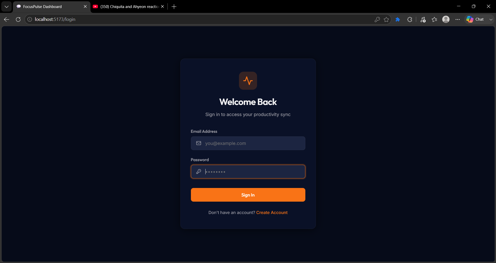
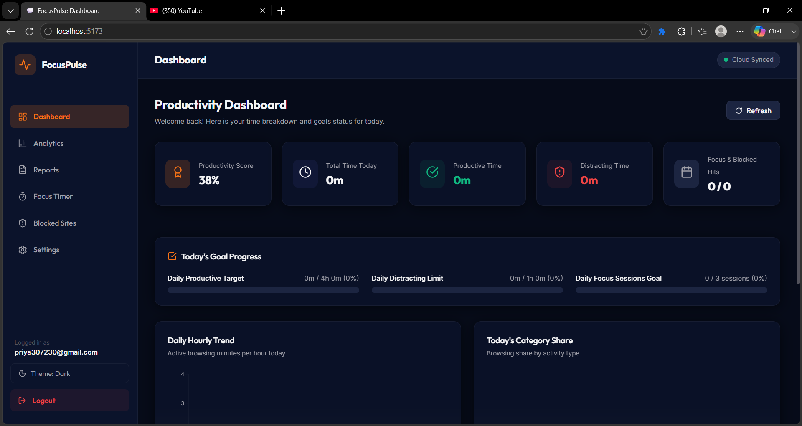
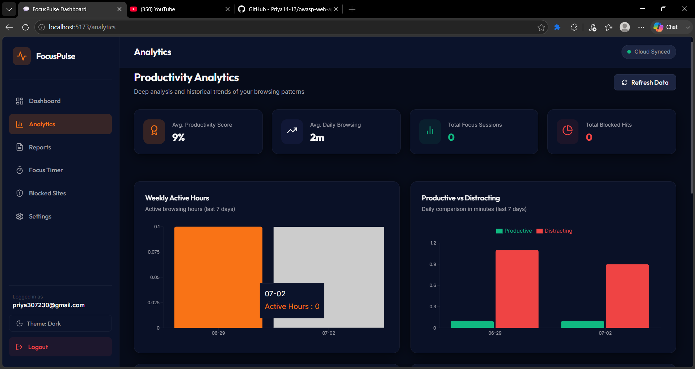
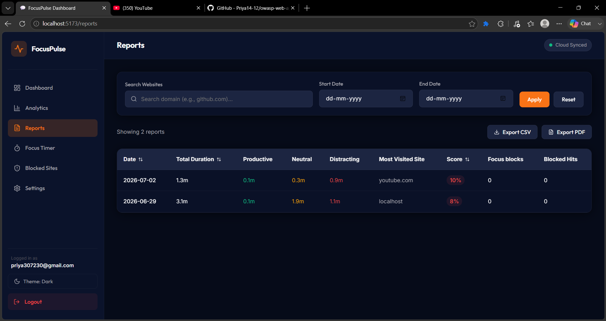
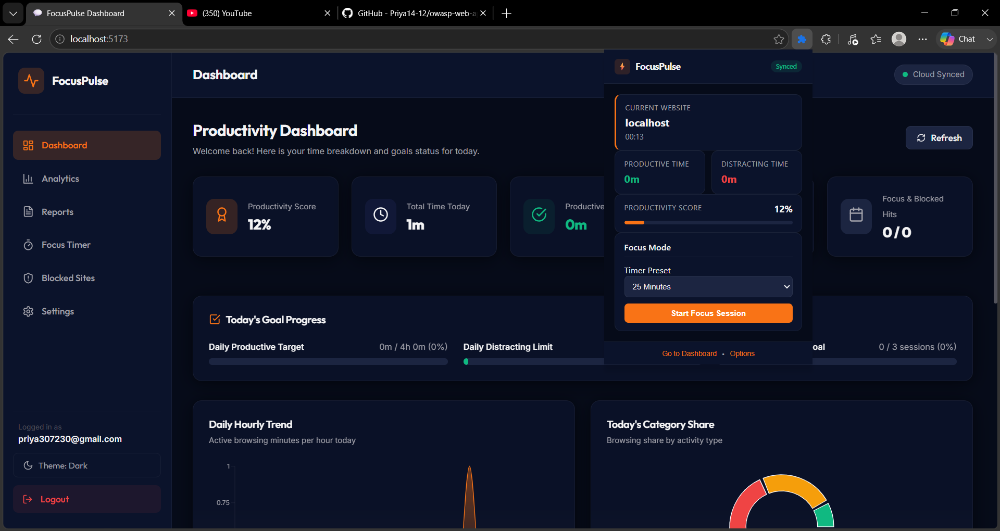
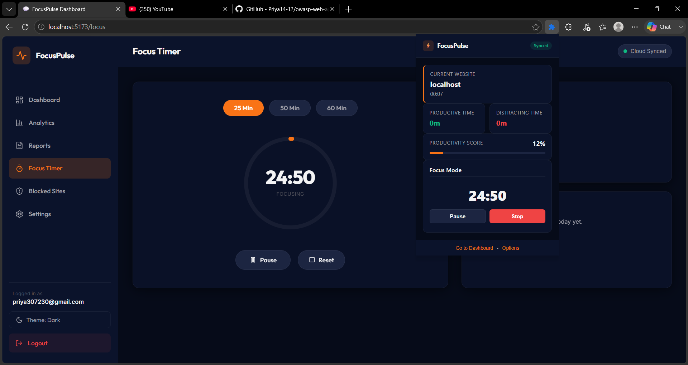
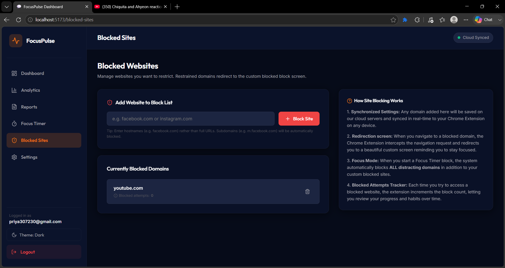
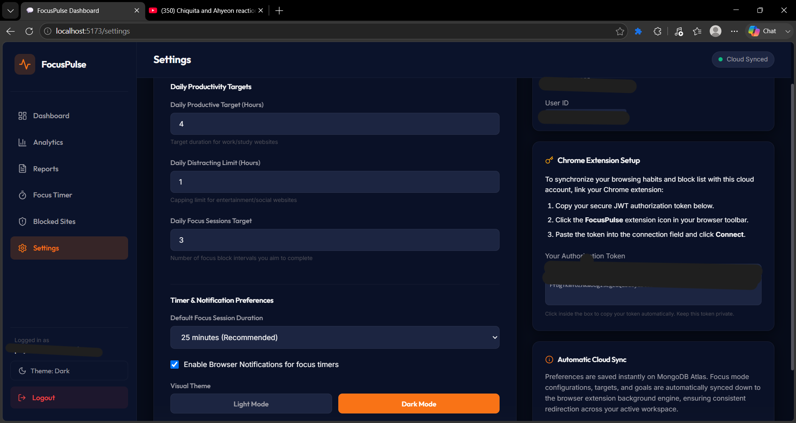

# FocusPulse: Productivity Management Chrome Extension

**COMPANY:** CODTECH IT SOLUTIONS

**NAME:** K.V. NANDAPRIYA

**INTERN ID:** CTIS9805

**DOMAIN:** MERN STACK WEB DEVELOPMENT

**DURATION:** 8 WEEKS

**MENTOR:** NEELA SANTHOSH

---

## 2. Task Description

The primary objective of this project is to build a full-stack **Productivity Management System** that enables users to gain granular control over their digital time and browsing habits. The project consists of two core components:
1.  **Manifest V3 Chrome Extension**: Intercepts active browser tab activity, measures active durations, enforces custom blocklists, automatically blocks distracting sites during Focus Mode sessions, and communicates with the backend cloud.
2.  **MERN Stack Web Dashboard**: Serves as the central administration panel. It provides user authentication (JWT), displays daily productivity scores and interactive usage trends, outputs CSV/PDF activity logs, and stores device-independent user settings in a cloud-based MongoDB Atlas cluster.

---

## 3. Core Features Implemented

### User Authentication & Cloud Synchronization
*   **JWT Security Flow**: Secure registration, login, and session preservation using JSON Web Tokens (JWT) and encrypted passwords (bcryptjs).
*   **Real-time Synchronization**: The Chrome Extension syncs browsing statistics, blocklist items, and target preferences to the cloud using secure REST API requests.

### Website Activity Tracking
*   **Active Tab Isolation**: Time tracking runs only for the active, focused browser tab in the active window, avoiding over-reporting from background tabs.
*   **Tab Lifecycle Monitors**: Listens to tab activation, window focus shifts, and URL changes to automatically save active browsing segments.

### Website Categorization
*   **Automatic Classification**: Web domains are classified into three core productivity groups:
    *   **Productive**: Developer tools, docs, and work applications (e.g., github.com, stackoverflow.com).
    *   **Neutral**: Standard search engines and utility sites (e.g., google.com, gmail.com).
    *   **Distracting**: Social media and entertainment domains (e.g., youtube.com, facebook.com, reddit.com).

### Website Blocking
*   **Custom Redirection Screen**: Restricts access to domains listed in the user's blocklist and redirects them to a custom HTML blocking page featuring random motivational quotes.
*   **Attempt Logging**: Increments the blocked site hit counter upon every blocked access attempt, which is logged and synced back to the dashboard database.

### Focus Mode
*   **Pomodoro Timer block**: Supports structured focus intervals (25, 50, or 60 minutes) that temporarily lock all distracting domains.
*   **Desktop Notifications**: Leverages the Chrome Notifications API to alert users when a focus session finishes, and saves completed blocks to the database.

### Daily Productivity Reports
*   **Productivity Score**: Automatically computes a daily productivity score out of 100 based on the ratio of productive to distracting browsing duration.
*   **Log Export**: Allows users to filter daily activity records by date range or website search query and export clean CSV logs or print-friendly PDF reports.

### Dashboard Analytics
*   **Deep Recharts Analytics**: Provides interactive, responsive visual charts to audit habits:
    *   *Daily Hourly Trend*: Area chart of browsing minutes per hour.
    *   *Weekly Active Hours*: Bar chart showing active hours over the past week.
    *   *Monthly Usage Trend*: Historical area chart of active hours over the past month.
    *   *Productive vs Distracting*: Comparative bar chart showing daily productive vs. distracting ratios.
    *   *Today's Category Share*: Pie chart detailing percentage splits of browsing time.
    *   *Top 5 Websites Today*: Horizontal bar chart ranking domains by usage duration.

### User Preferences & Settings
*   **Visual Themes**: Quick toggle switches for Visual Themes (Light/Dark Mode).
*   **Daily Goals & Limits**: Custom targets for daily productive hours, distracting hour limits, and focus sessions.
*   **Timer Defaults**: Allows configuration of default focus durations and browser notification toggles.

---

## 4. Technical Stack & Tools Used

### Frontend
*   **React.js (v18)**: Component-driven web interface layout.
*   **Vite**: Frontend bundler for fast development reloading and minified production builds.
*   **Recharts**: SVG chart library for responsive data representation.
*   **Lucide React**: Vector icons pack for user interface layouts.
*   **Axios**: HTTP client configuration with automatic header interceptors for token attachment.

### Chrome Extension
*   **Manifest V3 APIs**:
    *   `chrome.tabs`: Monitors active URL details.
    *   `chrome.storage.local`: Caches activities queue and connection settings.
    *   `chrome.alarms`: Triggers scheduled activity uploads to the cloud.
    *   `chrome.notifications`: Sends alarms warnings to the operating system.
    *   `chrome.webNavigation`: Intercepts and redirects blocked domains before page rendering completes.
*   **Popup & Options HTML/CSS/JS**: Modular extension screens styled with a cohesive dark visual theme.

### Backend
*   **Node.js & Express.js**: REST API server implementation.
*   **JSON Web Tokens (JWT)**: Handles session validation and protected routing.
*   **bcryptjs**: Hashes user passwords using cryptographically secure algorithms.
*   **express-rate-limit**: Secures API routes from rate attacks.
*   **express-validator**: Sanitizes and validates request payloads.

### Database & Security
*   **MongoDB Atlas**: Distributed cloud database storing users, settings, blocklists, activities, focus sessions, and daily reports.
*   **Mongoose**: Object Data Modeling (ODM) library validating database schemas.

---

## 5. Platforms & Environments Used

*   **Operating System**: Windows
*   **Browser**: Google Chrome (v110 or higher with Manifest V3 support)
*   **Database Host**: MongoDB Atlas
*   **Development IDE**: Visual Studio Code
*   **Testing Engines**: Jest and React Testing Library

---

## 6. Application Scope

FocusPulse is a digital well-being and time audit utility suitable for:
*   **Students**: Minimizes social media distractions during study sessions and measures focus durations.
*   **Software Developers**: Tracks time spent in documentation and coding environments, giving insight into core productive blocks.
*   **Remote Workers / Professionals**: Acts as a self-reported time auditor, helping users evaluate their daily performance.
*   **Organizations**: Promotes focus-oriented design structures and logs digital wellness trends.

---

## 7. Output Screenshots

### Login & Registration

### Dashboard

### Analytics

### Reports

### Extension Popup

### Focus Mode

### Website Blocking

### Settings

---

## 8. Conclusion

FocusPulse is a production-grade full-stack solution addressing the problems of digital distraction and time-management. By combining the low-level interceptive capabilities of Chrome Extension APIs (Manifest V3) with a cloud-connected MERN stack backend and a highly polished React visualization panel, the application successfully logs and redirects browsing habits. The internship project helped apply core MERN architecture principles, JWT authentication flows, database schema normalization in Mongoose, unit testing with Jest, and browser extension service worker setups.
